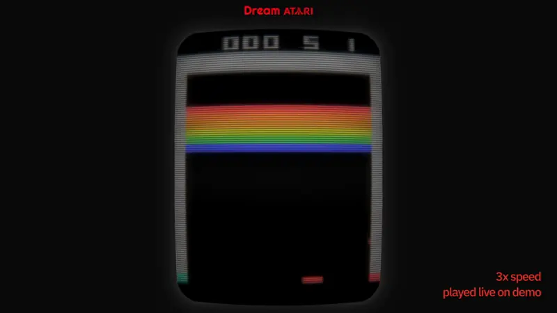
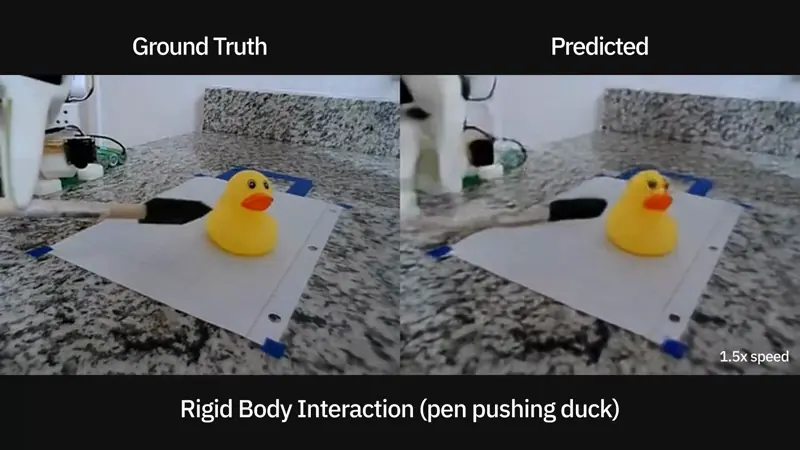

# visionary

visionary is a research repo aimed at training general-purpose agents inside world models. All of the work was done independently.

Current code and models are based on the [Dreamer 4](https://danijar.com/project/dreamer4) architecture.

## Dream Atari

**Dream Atari** is a collection of world models trained on five Atari games.

  
    
  <a href="https://www.hyeonseokjung.com/dream-atari"><strong>Demo Link</strong></a>

- Each model has only 7M parameters, enabling it to run in the browser up to 30fps, even on a phone.
- The models do not collapse even after long rollouts (~5 min).
- The training data was generated from a small DQN agent. I collected rollouts from checkpoints throughout training to capture diverse behaviors and dynamics of the environment.

## SO-101 world model

  
   
  <em>Rollouts use episodes from the held-out evaluation split.</em>

- Scaled the model to 300M parameters (still small!) and trained on community-sourced [SO-101 arm datasets](https://huggingface.co/datasets/allenai/MolmoAct2-SO100_101-Dataset).
- Cotrained the model on [SOAR](https://auto-improvement.github.io) and [BridgeData V2](https://rail-berkeley.github.io/bridgedata/) in order to transfer learned physics from fixed environments with lots of data to the diverse and noisy SO-101 environments, which have much less data per environment.
- Shows learned physics such as rigid body interactions (pushing objects with a tool), opening doors and shelves, and handling deformable objects like cloth. Watch the video for more.

## Code

| Path                         | Contents                                                        |
| ---------------------------- | --------------------------------------------------------------- |
| `visionary/models/dreamer4/` | Video tokenizer, dynamics model, and spatiotemporal transformer |
| `scripts/`                   | Training, evaluation, and dataset preparation                   |
| `scripts/atari/`             | Atari environments, agents, and rollout collection              |
| `scripts/robot/`             | Robot dataset processing                                        |
